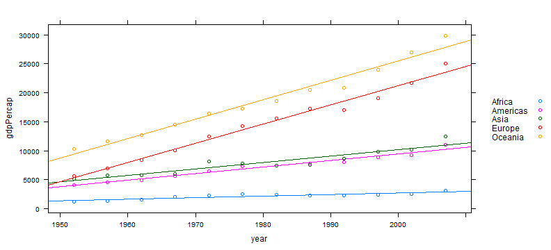

Dean Attali's View of the World
========================================================

First, let's load the data and the required libraries (in this case, just lattice for plotting)  
**Note:** The data is available [here](http://www.stat.ubc.ca/~jenny/notOcto/STAT545A/examples/gapminder/data/gapminderDataFiveYear.txt)


```r
library("lattice")
gDat <- read.delim("gapminderDataFiveYear.txt")
```


Now let's see some basic facts about what the dataset looks like.


```r
str(gDat)
```

```
## 'data.frame':	1704 obs. of  6 variables:
##  $ country  : Factor w/ 142 levels "Afghanistan",..: 1 1 1 1 1 1 1 1 1 1 ...
##  $ year     : int  1952 1957 1962 1967 1972 1977 1982 1987 1992 1997 ...
##  $ pop      : num  8425333 9240934 10267083 11537966 13079460 ...
##  $ continent: Factor w/ 5 levels "Africa","Americas",..: 3 3 3 3 3 3 3 3 3 3 ...
##  $ lifeExp  : num  28.8 30.3 32 34 36.1 ...
##  $ gdpPercap: num  779 821 853 836 740 ...
```


Okay, so there are 1704 rows, 142 countries, 5 continents... There is more to explore here, but instead of wasting space on these boring stats, let's have some fun!

Ready for the cool part?
--------------------------

I hear Africa isn't doing too well financially. Let's look at every continent's average GDP/capita over time.  
_Disclaimer: Doing this in a non-super-ugly way that worked took way too long, in the order of hours... I realize getting the exact statistic I wanted in this case was not worth the time, but I learned a lot of R through it :)_


```r
continentGdpByYear <- aggregate(gdpPercap ~ continent + year, data = gDat, FUN = mean)
xyplot(gdpPercap ~ year, continentGdpByYear, group = continent, type = c("p", 
    "r"), auto.key = list(space = "right"))
```

 


The simple linear lines are probably not the most correct models for all these data points, but we do see some interesting patterns. Europe and Oceania are both increasing their GDP/cap fairly consistently at about the same rate, with Asia and the Americas trailing behind but also growing slowly. Africa is way below, with a very slow growth - not a pretty picture.  
A few notes should be made:
* Oceania only has two countries in it, which is a very small sample size to draw conclusions from (to find this out using R, type `length(unique(subset(gDat, subset = continent == "Oceania")[['country']]))`)
* Europe, Asia, and the Americas had a fairly similar GDP/cap when the data was first collected in 1952. Europe took off much better than the other two continents since then.
* It would be interesting to split the Americas into North vs South America and see if there is a significant difference.

#### Some other commands I came up with throughout my painful learning experience that I'd like to keep a reference to
```
# seeing the effect of the Khmer Rouge in Cambodia
xyplot(pop ~ year, data=gDat, subset=country=="Cambodia", type=c("p","l"))
# attempting to get what the aggregate function ended up doing for me very nicely
mean(subset(gDat, subset= (continent=="Europe") & (year==2002), select="gdpPercap")[,1])
mean(gDat[which(gDat$continent == "Europe" & gDat$year == 2002), "gdpPercap"])
tempData <- gDat[which(gDat$year == 2002),]
tapply(tempData$gdpPercap, tempData$continent, mean)
tapply(gDat$gdpPercap, list(gDat$continent, gDat$year), mean)
```
